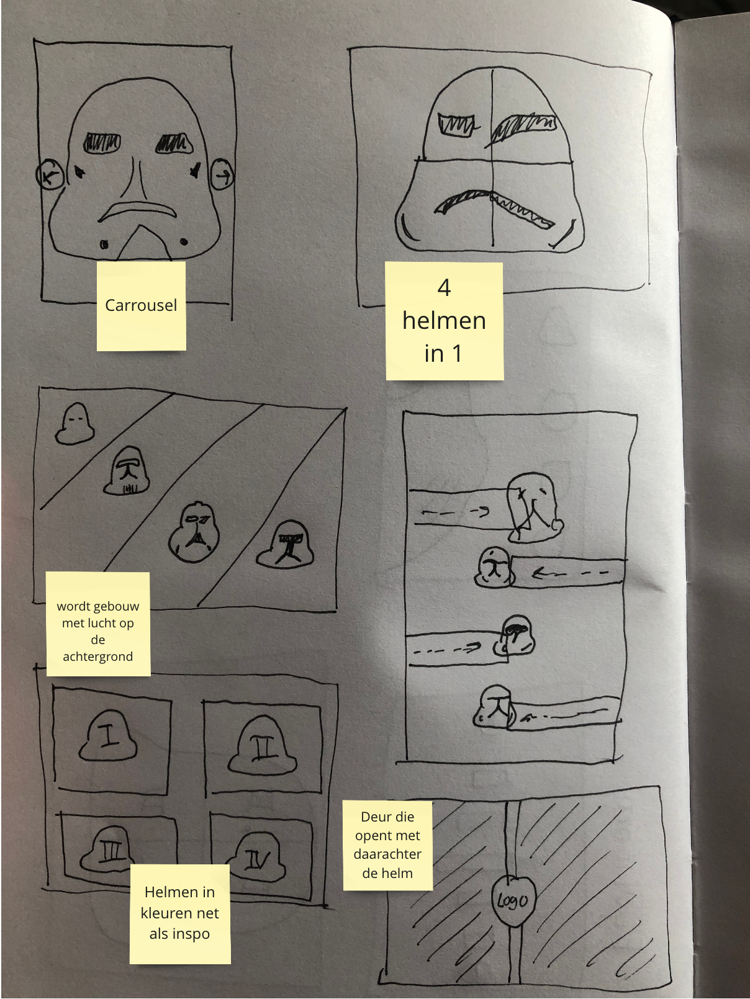
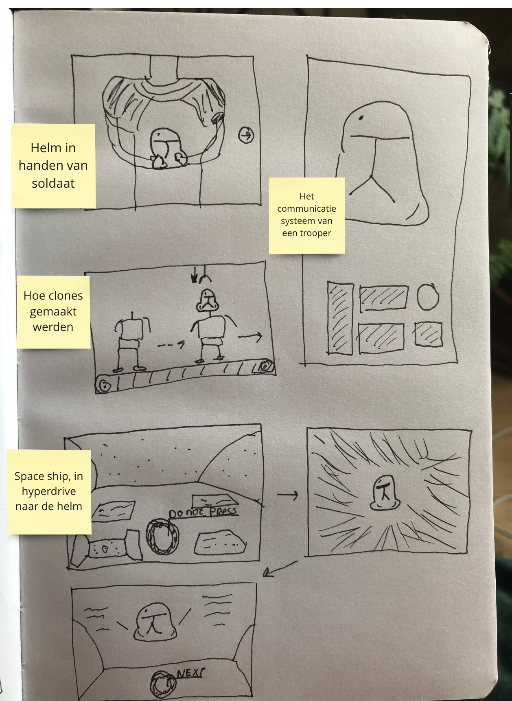
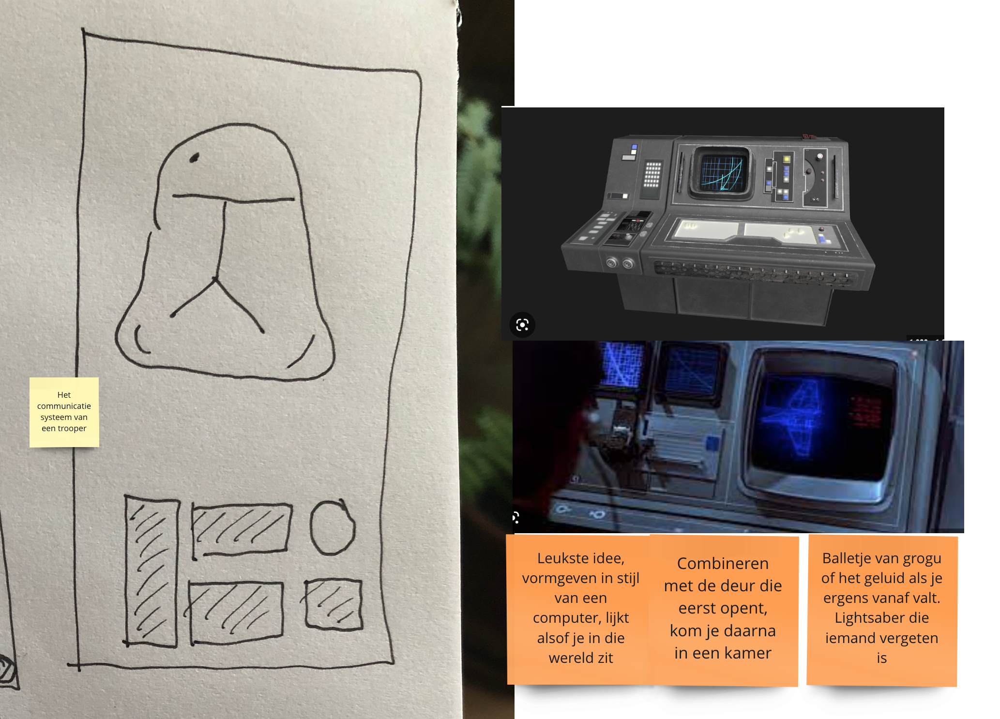
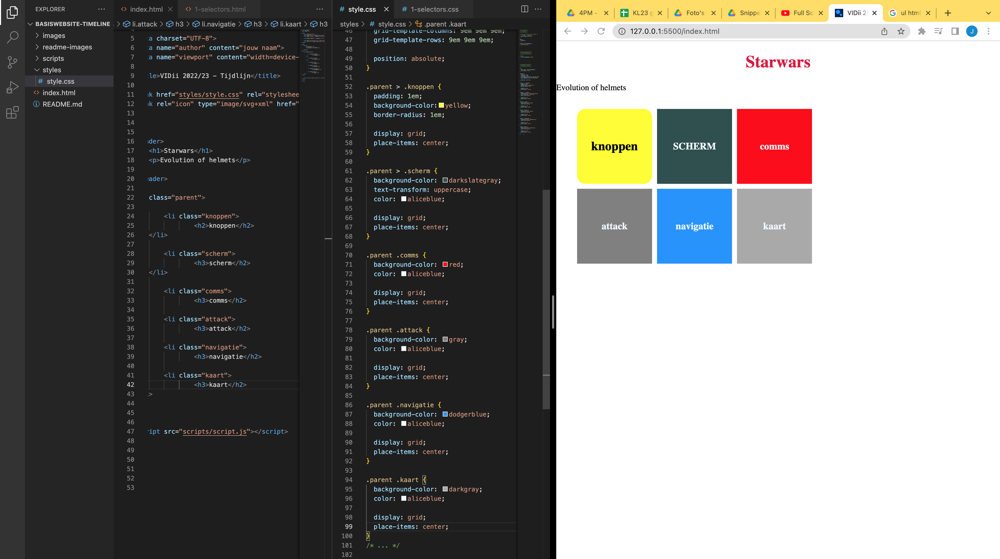
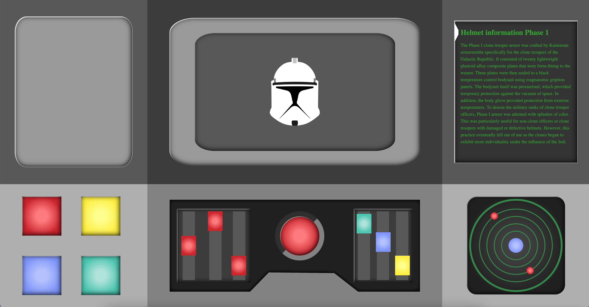
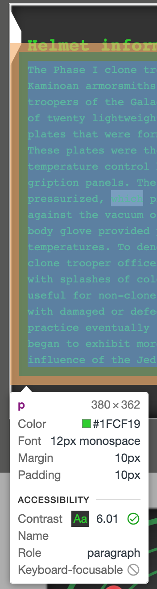
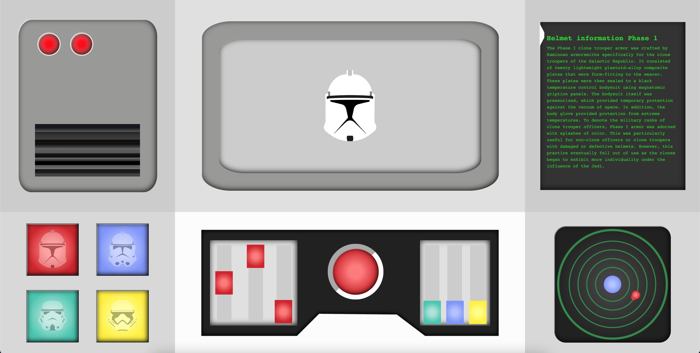
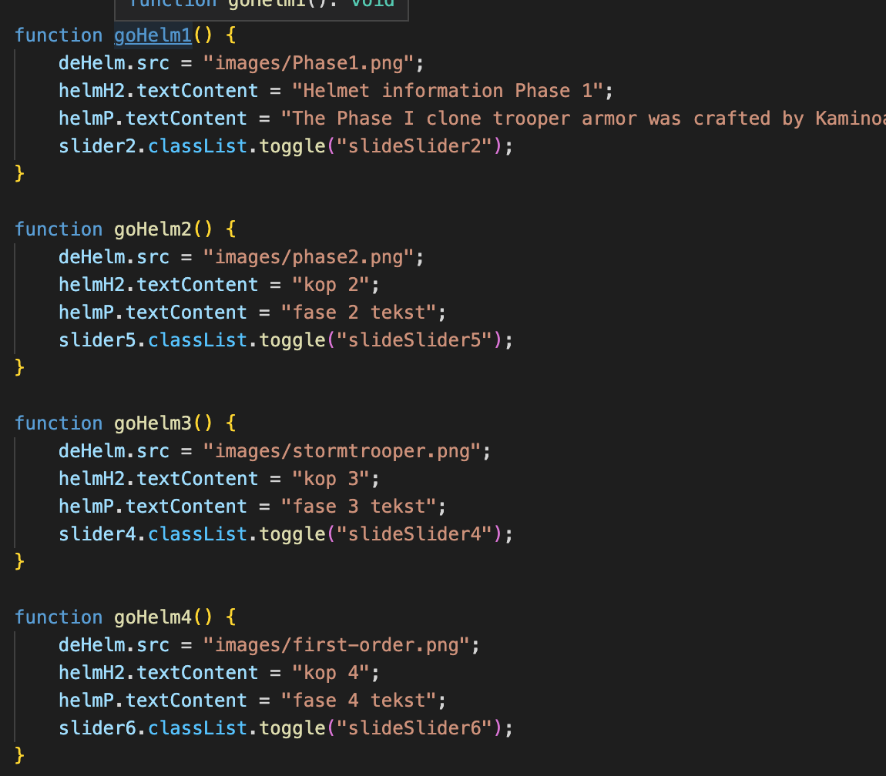
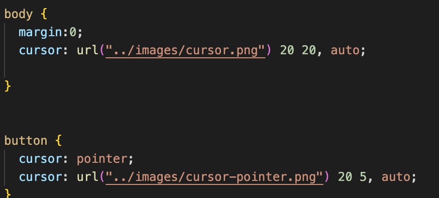
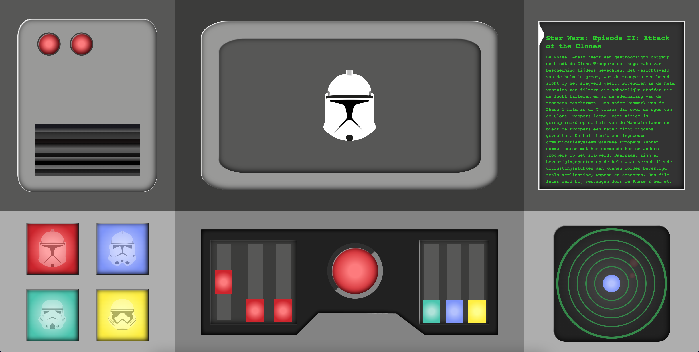

# Procesverslag
Markdown is een simpele manier om HTML te schrijven.  
Markdown cheat cheet: [Hulp bij het schrijven van Markdown](https://github.com/adam-p/markdown-here/wiki/Markdown-Cheatsheet).

Nb. De standaardstructuur en de spartaanse opmaak van de README.md zijn helemaal prima. Het gaat om de inhoud van je procesverslag. Besteedt de tijd voor pracht en praal aan je website.

Nb. Door *open* toe te voegen aan een *details* element kun je deze standaard open zetten. Fijn om dat steeds voor de relevante stuk(ken) te doen.

## Jij

### Ontwerper:
Jaime Hoogland Kolk

#### Je startniveau:
Blauw

# Je plan

  
De eerste versie/schets van je ontwerp & je persoonlijke uitdaging

  ### De eerste versie/schets:
  
  

  ### Je ambitie: 
  Aan deze technieken/punten wil ik werken:
  - Mijn eerste code opdracht maken
  - Een functionerend ontwerp neerzetten
  - Leren hoe ik interactieve code maak
  - In code leren animeren
  
 

## Voortgang/Feedback 1

  
Mijn bevindingen + wijzigingen (minimaal 5)

  ### Bevinding 1:
  In het begin kwam ik niet helemaal eruit wat voor thema ik wilde kiezen. in het begin koos ik voor een lightsaber maar kwam er al gauw achter dat, dat systeem erg complex in elkaar ziet om te vertellen in een tijdlijn

  #### oplossing:
  Ik ging verder zoeken in de star wars scene en kwam al snel op helmen van Clones terecht. Ik heb de clones en heel het concept daaromheen altijd interssant gevonden dus dit sloot mooi aan op mijn interesse.

  ### Bevinding 2:
  Ik begon met schetsen van verschillende interfaces die je zou kunnen hebben in de star wars wereld. Ik wilde iets wat logisch was en bij star wars paste en iets waar ik trots op kon zijn als design. 

  #### oplossing:
  Als oplossing ben ik gegaan voor vele schetsen en het zoeken naar inspiratie via pinterest, serie en stukjes film kijken. 

  ### Bevinding 3:
  Na het bekijken van mijn schetsen heb ik die in de les laten zien aan Merel W. Ze vond dat ik veel details had maar dat nog niet alles duidelijk was.

  #### oplossing:
  Samen hebben we van alle concepten 1 concept gemaakt en vanuit daar ben ik gaan nadenken.
  

  ### Bevinding 4:
  vanuit het concept ben ik opzoek gegaan naar verschillende elementen die vaker terug kwamen in star wars interfaces. 

  #### oplossing:
  Het opzoeken van interfaces en bekijken frames uit series en films ben ik op een design gekomen. Deze heb ik gemaakt in illustrator.

  ### Bevinding 5:
  Ik wil bijna heel mijn design in code maken zodat ik extra veel kan leren, omdat alles nieuw voor mij is.

  #### oplossing:
  Hiervoor moest ik een redelijk simpel design maken die past bij een star wars interface. 
  

## Voortgang/Feedback 2

  
Mijn bevindingen + wijzigingen (minimaal 5)

  
  ### Bevinding 1:
  Tatum heeft op 24-04 feedback gegeven, ze vond het design leuk en passen bij mijn concept. Ze vond dat ik nog iets meer kon kijken naar wat de knoppen doen en wat erop reageert.

  #### oplossing:
  Ik heb de knoppen links een foto gegeven zodat je weet welke helm je krijgt wanneer je klikt. Dit heb ik opgelost met Javascript. 
  
  

  ### Bevinding 2:
  Ook kon ik nog kijken naar het contrast in mijn interface. De groene lettertype voldeed niet aan de norm van 4.5 contrast 

  #### oplossing:
  Via inspecteren heb ik een nieuwe kleur gekozen voor het lettertype zodat ik precies aan de norm van contrast kon doen. 
  

  ### Bevinding 3:
  Tatum vond niks speciaals aan mijn code, maar wanneer ik hem aan sanne liet zag hij dat er een paar Li-tjes niet waren afgesloten. en dat ik alles gepositioneerd had ten opzichte van het scherm. Dit was niet mijn bedoeling.

  #### oplossing:
  Samen met sanne heb ik de gekeken naar hoe dingen wel gepositioneerd moesten worden. En ben ik er achter gekomen dat je dingen eerst moet aanspreken via een grid. En in dat grid ook nog een keer een grid met een relative. 

  ### Bevinding 4:
  De knoppen waren nog niet heel duidelijk dat je er ook echt op kon klikken.

  #### oplossing:
  Ik heb een hover state toegevoegd. zodat het nog duidelijker is dat hij klikbaar is

  ### Bevinding 5:
  Ook zei tatum als laatst dat het handig is om alles een naam te geven wat je doet, zo onthoud je wat doet en kan je die code makkelijker opnieuw kijken. 

  #### oplossing:
  Een uitleg regel toevoegen boven alles wat wat is en bij moeilijke stukjes uitleggen wat ik heb toegepast.

## Voortgang/Feedback 3

  
Mijn bevindingen + wijzigingen (minimaal 5)

  
  ### Bevinding 1:
  Derde feedback heb ik aan Michael gevraagd. Hij had mijn werk nog niet gezien. Hij vond dat ik nog even kon kijken naar de darkmode.  

  #### oplossing:
  OMdat mijn interface van origin darkmode is heb ik besloten om mijn darkmode een lightmode te maken. Zo weet ik toch hoe het werkt en weet ik hoe ik een light en dark mode kan maken in mijn design
  

  ### Bevinding 2:
  Michael vond ook dat de responsiveness niet hoog genoeg was, dit is mijn fout doordat ik niet goed gebruik heb gemaakt van de position relative en position absolut. 

  #### oplossing:
  Dit probleem heb ik samen met sanne besproken en hij heeft me uitlegd dat ik alles ten opzichte van het scherm had gepositioneerd waardoor het niet mee schaalt. De kolom links onder doet het wel goed want die hebben we samen opgelost. 

  ### Bevinding 3:
  Hij vond mijn javascript netjes gestructueerd en ik kon nog wat meer feedback geven aan de gebruiker wanneer je ergens op klikt. 

  ### oplossing:
  Ik heb de cursor veranderd en ik heb in de javascript toegevoegd dat als je op een helm knop klikt er dan ook een slider beweegt. Dan heb je het gevoel dat die samen werken. 
  
  

  ### Bevinding 4:
  Ik had verteld dat de rode knop een video heeft. Maar de video werkt niet op github.  

  ### oplossing:
  Ik heb hier nog geen oplossing voor (gefixt geen idee hoe)

  ### Bevinging 5: 
  Michael zag ook dat als je met de states er door heen gaat dat het alleen is bij de helm knoppen en niet bij de sliders. 

  ### oplossing: 
  Ik heb een glow toegevoegd als je met button focus erover heen gaat. Hierdoor lijkt het alsof de knop oplicht als je er doorheen tapt. 

## Reflectie

  
Mijn eindresultaat & persoonlijke ontwikkeling

  ### Je uitkomst - karakteristiek screenshot(s):
  

  ### Dit ging goed/Heb ik geleerd: 
  In het begin was ik overweldigd door wat allemaal kan met code en hoeveel werk er achter zit. Ik had nog nooit iets gecodeerd en wist niet eens in welk progamma ik moest werken. Langzamerhand kreeg ik het steeds beter onder de knie. Dit komt omdat ik alle lessen heb gevolgd en alles van brightspace heb geprobeerd.

  Dit ging goed:
   - Het bedenken van een ontwerp dat ook werkt met code. 
   - Het maken van een grid met een duidelijk plan in mijn hoofd
   - Het stijleren van box-shadows en geven van kleurtjes
   - Het kleine beetje van javascript begrijpen maar nog wel moeilijk toe te passen.

  

  ### Dit was lastig/Is niet gelukt:
  Ik wilde nog meer helmen en informatie toevoegen, maar zag geen ruimte ervoor in mijn design. Ik wilde het met een soort swipe weg animatie de helmen laten in komen maar dat was geen beginnen aan. 

  Ik wilde de video die ik als paasei had verstopt laten zien op github maar kom er niet achter waarom die het niet laat zien. (gefixt geen idee hoe)

  Ik wilde alles wat meer textuur geven door een lichte grunge toe te voegen, maar de grunge kreeg ik niet meer op mijn juiste onderdelen. 

  Ik dacht dat het positioneren van de content goed ging, maar uiteindelijk heb ik de position relative en absolut niet helemaal goed toegepast.

  De button state "Active" werkte niet. de focus en hover zijn wel gelukt. 

## Bronnenlijst

continu bijhouden terwijl je werkt

Nb. Wees specifiek ('css-tricks' als bron is bijv. niet specifiek genoeg).

1. Chat GPT - voor informatie van star wars helmen
2. https://medium.com/contractize-inc/star-wars-and-when-design-became-a-requirement-d1bf692d29c2 
3. http://www.starwarshelmets.com/original-stormtrooper-helmets-sub-submenu.htm 
4. De helm: https://www.wallpaperflare.com/storm-troopers-minimalism-star-wars-helmet-wallpaper-uriis 
5. Code van Tatum voor de Audio. 
6. Code van Leonie voor de video.
7. Sanne voor al het gene wat niet lukte. 

